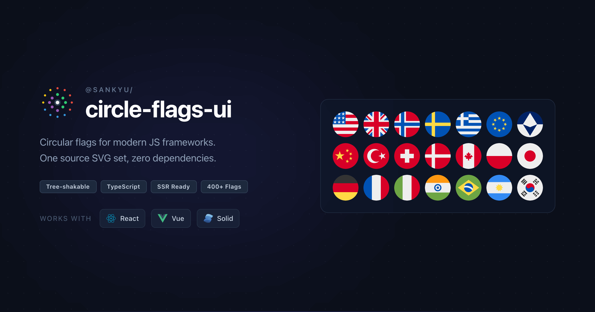

<div align="center">
  <a href="https://react-circle-flags.js.org/">
    
  </a>

  <h1>circle-flags-ui</h1>

  <p><strong>400+ circular SVG flag components</strong> for React, Vue 3, Solid.js, and Svelte 5</p>

  <!-- Package versions -->

<a href="https://www.npmjs.com/package/@sankyu/react-circle-flags"></a> <a href="https://www.npmjs.com/package/@sankyu/vue-circle-flags"></a> <a href="https://www.npmjs.com/package/@sankyu/solid-circle-flags"></a> <a href="https://www.npmjs.com/package/@sankyu/svelte-circle-flags"></a>

  <!-- CI/CD & Quality -->

<a href="https://github.com/SanKyu-Lab/circle-flags-ui/actions/workflows/ci.yml"></a> <a href="https://github.com/SanKyu-Lab/circle-flags-ui/actions/workflows/pr-checks.yml"></a> <a href="https://github.com/SanKyu-Lab/circle-flags-ui/actions/workflows/release.yml"></a> <a href="https://github.com/SanKyu-Lab/circle-flags-ui/actions/workflows/deploy-website.yml"></a>
<a href="https://codecov.io/gh/SanKyu-Lab/circle-flags-ui"></a>

  <!-- Meta -->

<a href="https://www.typescriptlang.org/"></a> <a href="./LICENSE"></a> <a href="https://github.com/SanKyu-Lab/circle-flags-ui/commits/main"></a>

<br /><br />

<a href="https://react-circle-flags.js.org/browse">🚀 Demo Gallery</a> · <a href="https://react-circle-flags.js.org/docs/guides/getting-started/">📖 Documentation</a> · <a href="https://github.com/SanKyu-Lab/circle-flags-ui/issues">🐛 Issues</a>

</div>

---

<div align="center">
  <a href="https://react-circle-flags.js.org/">
    
  </a>
</div>

## 📦 Package Matrix

| Framework                                                                                | Package                                                                                    | Status                                                                 | Live Demo                                                                                                                                                                                                                                                       | Docs                                  |
| ---------------------------------------------------------------------------------------- | ------------------------------------------------------------------------------------------ | ---------------------------------------------------------------------- | --------------------------------------------------------------------------------------------------------------------------------------------------------------------------------------------------------------------------------------------------------------- | ------------------------------------- |
|  **React**      | [`@sankyu/react-circle-flags`](https://www.npmjs.com/package/@sankyu/react-circle-flags)   |  | [](https://stackblitz.com/fork/github/SanKyu-Lab/circle-flags-ui/tree/main/examples/example-react?file=src%2FApp.tsx&terminal=dev)     | [README](./packages/react/README.md)  |
|  **Vue 3**          | [`@sankyu/vue-circle-flags`](https://www.npmjs.com/package/@sankyu/vue-circle-flags)       |     | [](https://stackblitz.com/fork/github/SanKyu-Lab/circle-flags-ui/tree/main/examples/example-vue?file=src%2FApp.vue&terminal=dev)       | [README](./packages/vue/README.md)    |
|  **Solid.js** | [`@sankyu/solid-circle-flags`](https://www.npmjs.com/package/@sankyu/solid-circle-flags)   |     | [](https://stackblitz.com/fork/github/SanKyu-Lab/circle-flags-ui/tree/main/examples/example-solid?file=src%2FApp.tsx&terminal=dev)     | [README](./packages/solid/README.md)  |
|  **Svelte 5** | [`@sankyu/svelte-circle-flags`](https://www.npmjs.com/package/@sankyu/svelte-circle-flags) |     | [](https://stackblitz.com/fork/github/SanKyu-Lab/circle-flags-ui/tree/main/examples/example-svelte?file=src%2FApp.svelte&terminal=dev) | [README](./packages/svelte/README.md) |

## ✨ Features

- 🎯 **Tree-shakable** — Only bundle the flags you actually use
- 📦 **TypeScript** — Full type definitions for all 400+ flags
- ⚡ **Offline-first** — Inline SVG, zero runtime network requests
- 🔧 **Customizable** — All standard SVG props supported (`width`, `height`, `className`, ...)
- 📱 **SSR-friendly** — Works with Next.js, Nuxt, SolidStart, SvelteKit, and more
- 🪶 **Lightweight** — ~1 KB per flag component
- 🧩 **Shared core** — Single source of truth, framework-specific output

## 🚀 Quick Start

Pick the package for your framework and install it:

```bash
# React
pnpm add @sankyu/react-circle-flags

# Vue 3
pnpm add @sankyu/vue-circle-flags

# Solid.js
pnpm add @sankyu/solid-circle-flags

# Svelte 5
pnpm add @sankyu/svelte-circle-flags
```

Then import named flag components directly:

```tsx
// React example
import { FlagUs, FlagCn, FlagGb } from '@sankyu/react-circle-flags'

export default function App() {
  return (
    <div>
      <FlagUs width={48} height={48} />
      <FlagCn width={48} height={48} />
      <FlagGb width={48} height={48} />
    </div>
  )
}
```

> See per-package READMEs for Vue and Solid usage examples.

## 🤖 Vibe Coding?

Paste this prompt into your AI agent (Claude, Cursor, Codex, etc.) to migrate or optimize flag usage in your project:

<details>
<summary>AI Agent Prompt</summary>

```txt
Act as an expert Web Engineer. Reference: https://react-circle-flags.js.org/llms.txt & https://react-circle-flags.js.org/llms-small.txt

1. Audit my project to find any flag usage:
   - Raw  tags pointing to HatScripts/circle-flags URLs.
   - Legacy react-circle-flags library usage.
2. Propose a migration to the appropriate @sankyu/{framework}-circle-flags package based on my framework (React/Vue/Solid/Svelte).
3. Optimize for Tree-shaking: replace generic CircleFlag components with named imports (e.g. import { FlagUs } from '...') as per the docs.
```

</details>

## 🛠️ Monorepo Development

```bash
# Install dependencies
pnpm install

# Generate flag components from source SVGs
pnpm run gen:flags

# Build all packages
pnpm run build

# Quality checks
pnpm run lint
pnpm run typecheck
pnpm run test
```

## 📂 Repository Layout

```text
circle-flags-ui/
├── packages/
│   ├── core/      # shared types, utils, generated registry (private)
│   ├── react/     # @sankyu/react-circle-flags
│   ├── vue/       # @sankyu/vue-circle-flags
│   ├── solid/     # @sankyu/solid-circle-flags
│   └── svelte/    # @sankyu/svelte-circle-flags
├── examples/      # per-framework example apps
├── scripts/       # generation / build / release scripts
└── website/       # documentation site (Astro)
```

## Credits

Flag designs from [HatScripts/circle-flags](https://github.com/HatScripts/circle-flags).

## License

- Repository and packages: MIT © [Sankyu Lab](https://github.com/SanKyu-Lab)
- `website/`: GPL-3.0 (see [`website/LICENSE`](./website/LICENSE))
